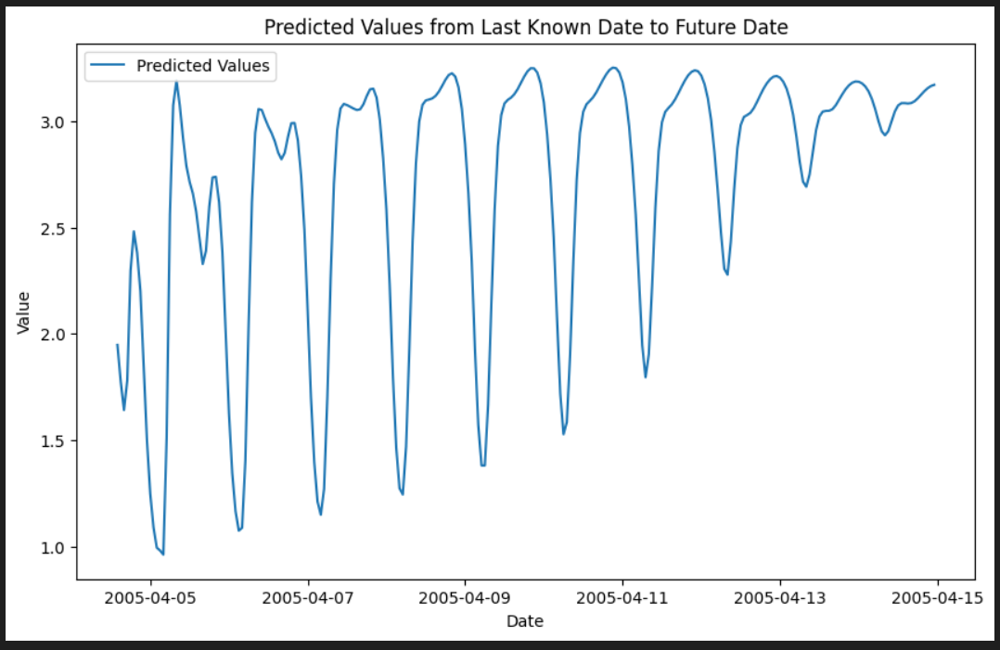

1. training with 10 epochs, LSTM(50)
   Predicted value at 2005-05-11 19:00:00: 3.005616375803948
   Predicted value at 2005-04-11 19:00:00: 3.005616375803948
   Predicted value at 2005-04-12 13:00:00: 3.005615666508675

2. training with 40 epochs, LSTM(50)
   Predicted value at 2005-04-12 13:00:00: 0.9350867442786694
   Predicted value at 2005-04-12 09:00:00: 1.41403456479311
   Predicted value at 2005-04-12 01:00:00: 2.601187559962273
   Predicted value at 2005-04-12 04:00:00: 2.202501553297043
   Predicted value at 2005-04-14 04:00:00: 1.9597812429070474

3. training with 150 epochs, LSTM(50)
   Predicted value at 2005-04-14 04:00:00: 4.055741149187089
   Predicted value at 2005-04-14 06:00:00: 4.055740794539452
   Predicted value at 2005-04-14 08:00:00: 4.055739730596542
   Predicted value at 2005-04-14 10:00:00: 4.055740085244179
   Predicted value at 2005-04-14 12:00:00: 4.055740794539452
   Predicted value at 2005-04-13 12:00:00: 4.055737248063088
   Predicted value at 2005-04-12 12:00:00: 4.055723771452904

4. training with 150 epochs -> interpolate, LSTM(50)
   Predicted value at 2005-04-12 12:00:00: 1.1742065936326982
   Predicted value at 2005-04-13 12:00:00: 1.1736727625131609
   Predicted value at 2005-04-13 12:00:00: 1.1736727625131609

5. training with 50 epochs -> interpolate, LSTM(50)
   Predicted value at 2005-04-14 12:00:00: 1.17351855635643
   Predicted value at 2005-04-13 12:00:00: 3.470724332332611
   Predicted value at 2005-04-12 12:00:00: 3.470724332332611
   

6. training ,it 25 epochs, 80/20 split, seq_length = 24
   

7. Number of neurons increase or decrease the y-value while the amplitude is decreasing over time
   

8.
